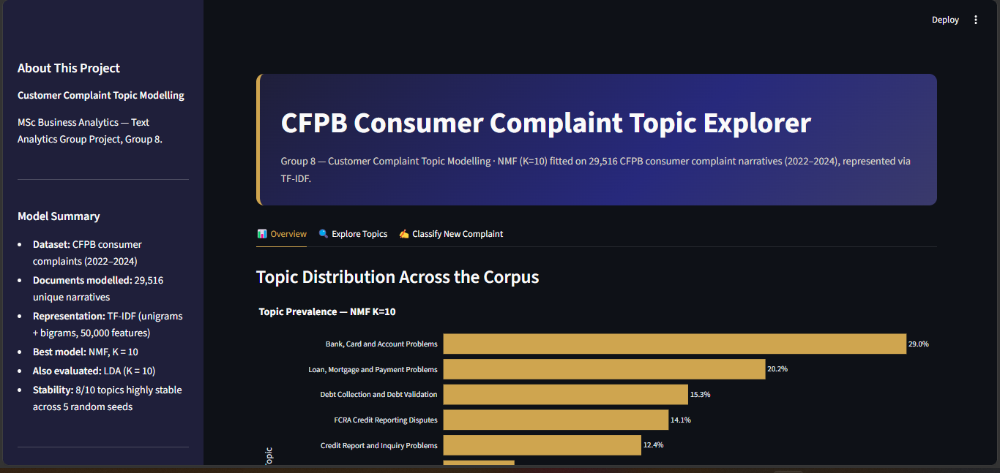

# CFPB Consumer Complaint Topic Explorer

**MSc Business Analytics — Text Analytics Group Project (Group 8)**
Customer Complaint Topic Modelling using NMF and LDA on CFPB consumer complaint narratives.

**Live app:** [Add your share.streamlit.io URL here once deployed]



## Overview

This project applies unsupervised topic modelling to a sample of 29,516 unique CFPB
consumer complaint narratives (2022–2024), represented via TF-IDF, to discover the
latent themes running through consumer financial complaints. Two models were built
and compared — **Non-negative Matrix Factorization (NMF)** and **Latent Dirichlet
Allocation (LDA)** — with NMF selected as the final model based on topic coherence,
diversity, interpretability, and distribution.

## What the app does

The Streamlit app has three tabs:

- **Overview** — topic prevalence across the full corpus, with the ten discovered
  topics and their relative sizes
- **Explore Topics** — browse representative complaints and top terms for any
  of the ten topics
- **Classify New Complaint** — paste in new complaint text and see it classified
  live against the trained NMF model, with a topic-weight breakdown

## Model summary

| | |
|---|---|
| Dataset | CFPB Consumer Complaint Database, 2022–2024 |
| Documents modelled | 29,516 unique narratives (484 exact duplicates removed) |
| Representation | TF-IDF, unigrams + bigrams, 50,000 features |
| Final model | NMF, K = 10 |
| Also evaluated | LDA, K = 10 (on both word counts and TF-IDF) |
| Stability | 8/10 topics highly stable across 5 random seeds (Hungarian-matched) |

Full methodology, evaluation, and limitations are documented in the accompanying
written report.

## Running locally

```bash
pip install -r requirements.txt
streamlit run streamlit_app.py
```

## Files

- `streamlit_app.py` — main Streamlit application
- `save_model_artifacts.py` — script used to fit and save the TF-IDF vectorizer and NMF model
- `tfidf_vectorizer.joblib`, `nmf_model.joblib` — trained model artifacts
- `final_topic_interpretation_k10.csv` — topic labels, sizes, and interpretation
- `representative_complaints_k10.csv` — example complaints per topic
- `topic_terms_k10.json`, `topic_labels.json` — topic term/label lookups
